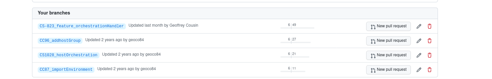
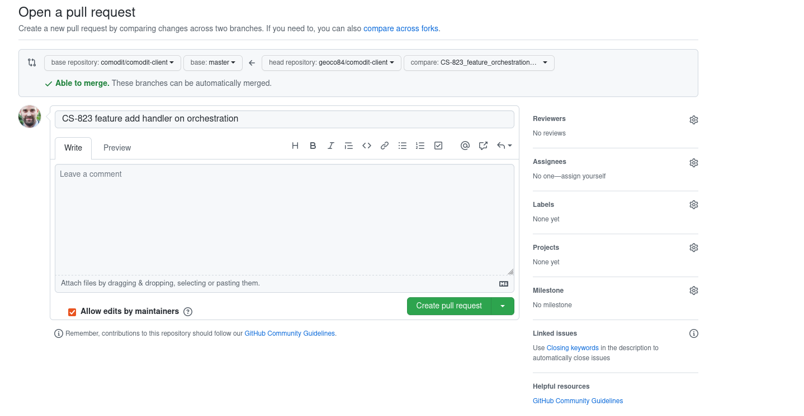
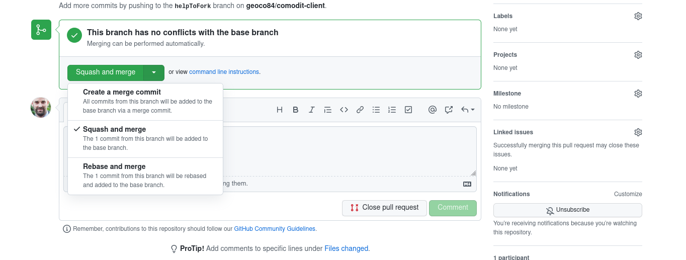

# Contributing on project

## Fork repository

1. Go to https://github.com/comodit/comodit-client
2. Fork project in your repository 
3. Clone forked project in your laptop 
4. Configure remote project
 
        $ git remote add upstream  https://github.com/comodit/comodit-client.git

more information [GitHub help](https://docs.github.com/en/get-started/quickstart/fork-a-repo)

## Create new branch for feature or fixed

> if you cloned your repository not now. Read before Retrieve change from source project

Create branch

        $ git checkout -b branchName

Commit changes

        $ git commit -am "description of change"

Push changes

        $ git push origin <branch_name>

## Create PullRequest

1. Go to https://github.com/<REPO_NAME>/comodit-client/branches

#### 

2. Click to create "New pull request"

#### 

In GitHub flow, Pull request merge directly in branch master of source project

3. Click on create button "Create pull request"
4. Verify your change
5. Ask to someone to verify your change and accept the pull request

more information [GitHub help](https://docs.github.com/en/pull-requests/collaborating-with-pull-requests/proposing-changes-to-your-work-with-pull-requests/creating-a-pull-request#changing-the-branch-range-and-destination-repository)

## Accept PullRequest with squash

When you accept the change, select and merge and push on it.

This option create only one commit with all your commit and you can write a description for details.
Now your change it's on branch master of comodit-client repository 
### 

## Retrieve change from source project

      $ git checkout master
      $ git fetch upstream
      $ git rebase upstream/master

